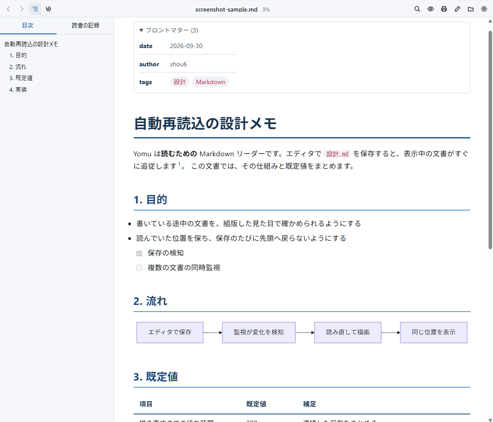

# Yomu

[](https://github.com/shou6/yomu-desktop/actions/workflows/ci.yml)

[English](README.md)

和文を読みやすく組むことを重視した、デスクトップ向けの Markdown リーダーです。
`.md` ファイルをダブルクリックすると、VS Code 拡張機能 [Yomu](https://github.com/shou6/yomu) と同じ組版で開きます。
編集はしません。直したい時はワンクリックでエディタを開き、保存すると表示が追従します。



## 機能

- **和文の組版**：和文と欧文でフォントを分け、行間を広めにとり、約物のアキを詰めます。和文フォントを同梱しているので、どの OS でも同じ見た目になります。
- **描画**：CommonMark と GFM（表、取り消し線、タスクリスト、脚注）に対応します。
  - コードの色付け、Mermaid の図、見出しのアンカー、ローカルとウェブの画像を出します。
  - 数式は KaTeX で描きます（`$...$`、`$$...$$`、言語が `math` のコードブロック）。
  - YAML front matter は折りたたみの中に表で出します。
  - 生の HTML は `<details>`、`<summary>`、`<kbd>`、`<sub>`、`<sup>`、`<br>` と、`<span>`、`<b>`、`<mark>` などの行内の装飾タグだけを通し、ほかのタグは文字として出します。
  - 行内のタグの `style` は、色と文字装飾（`color`、`background-color`、`font-weight`、`font-style`、`text-decoration`、`font-size`）だけが効きます。
- **テーマ**：`auto`（OS のライトとダークに合わせる）、`paper`、`sepia`、`dark`、Solarized、GitHub、Nord、Catppuccin。
- **目次**：サイドパネルに見出しを並べます。クリックで移動し、スクロールに合わせて今読んでいる見出しを示します。
- **文書間のリンク**：相対リンクの Markdown は同じウィンドウで開きます（`#見出し` にも対応）。ブラウザのように戻る・進むができます。ほかのファイルは既定のアプリで、ウェブのリンクはブラウザで開きます。
- **読書の記録**：ツールバーに読んだ割合を出し、次に開いた時は前回の位置から再開します。サイドパネルに最近の文書を割合付きで並べます。
- **自動再読込**：エディタで保存すると、スクロールの位置を保ったまま表示を更新します。
- **エディタで開く**：今読んでいる行を指定して、エディタで開きます。
- **ページ内検索**、**集中モード**（読んでいるブロック以外を薄くする）、画像と図の**ズーム**、長いコードの**折りたたみ**、**印刷と PDF**、**カスタム CSS**。
- **英語と日本語**：画面の言語は OS に合わせます。設定で選ぶこともできます。

## インストール

[Releases](https://github.com/shou6/yomu-desktop/releases) から、OS に合ったインストーラーをダウンロードします。

| OS | ファイル |
| --- | --- |
| Windows 10 / 11（x64） | `Yomu_<版>_x64-setup.exe` |
| macOS（Apple Silicon と Intel） | `Yomu_<版>_universal.dmg` |
| Linux | `Yomu_<版>_amd64.AppImage` か `Yomu_<版>_amd64.deb` |

インストーラーにはコード署名をしていないので、初回は OS が警告を出します。

- **Windows**：SmartScreen の「Windows によって PC が保護されました」が出ます。「詳細情報」を押し、「実行」を押します。
- **macOS**：「開発元を確認できない」として開けません。「システム設定」→「プライバシーとセキュリティ」で「このまま開く」を押します。「壊れている」と出る時は、ターミナルで `xattr -dr com.apple.quarantine /Applications/Yomu.app` を実行します。
- **Linux**：警告は出ません。AppImage は `chmod +x` で実行できるようにします。

Windows のインストーラーは `.md` と `.markdown` に Yomu を登録します。ダブルクリックで Yomu が開くようにするには、OS の設定で既定のアプリを Yomu にします。

## 使い方

次のどれかでファイルを開きます。

- `.md` ファイルをダブルクリックする（既定のアプリを Yomu にした場合）か、「プログラムから開く」で Yomu を選ぶ
- ウィンドウにファイルをドロップする
- ツールバーの「ファイルを開く」を押すか、Ctrl+O を押す

### ショートカット

macOS では Ctrl を Cmd に読み替えます。

| 操作 | キー |
| --- | --- |
| ファイルを開く | Ctrl+O |
| 戻る / 進む | Alt+← / Alt+→、マウスの戻る・進むボタン |
| サイドパネルの開閉 | Ctrl+B |
| ページ内検索 | Ctrl+F（Enter で次、Shift+Enter で前、Esc で閉じる） |
| 集中モード | Ctrl+Shift+F |
| 印刷 | Ctrl+P |
| エディタで開く | Ctrl+E |
| 設定 | Ctrl+, |

## 設定

ツールバーの「設定」（Ctrl+,）で開きます。変えるとすぐに反映します。
設定はアプリの設定フォルダの `settings.json`（Windows は `%APPDATA%\io.github.shou6.yomu`）に保存します。

| 設定 | 既定値 | 内容 |
| --- | --- | --- |
| `theme` | `auto` | `auto` は OS がライトなら `paper`、ダークなら `dark`。ほかに `sepia`、`solarized-light`、`solarized-dark`、`github-light`、`github-dark`、`nord`、`catppuccin-latte`、`catppuccin-mocha`。 |
| `frontMatter` | `collapsed` | YAML front matter の見せ方。`collapsed`（閉じる）、`expanded`（開く）、`hidden`（出さない）。 |
| `focusMode` | `false` | 読んでいるブロック以外を薄くする。 |
| `layout.maxWidth` | `820` | 本文の最大幅（px）。`0` で制限なし。 |
| `layout.align` | `center` | 広いウィンドウでの本文の位置。`left`、`center`、`right`。 |
| `layout.padding` | `32` | 左右の余白（px）。 |
| `font.family` | 欧文フォント、続いて和文フォント | 本文の CSS の `font-family`。欧文フォントを先に、和文フォントを後に並べる。 |
| `font.codeFamily` | （空） | コードのフォント。空なら、半角と全角が 1:2 の和文等幅フォントを使い、テキストの図が揃う。 |
| `font.size` | `16` | 文字の大きさ（px）。 |
| `font.lineHeight` | `1.8` | 行間（文字の大きさの倍率）。 |
| `code.foldLines` | `20` | これより長いコードブロックを畳む。`0` で畳まない。 |
| `editor.command` | （空） | エディタで開くコマンド。`{file}` はファイルのパス、`{line}` は今読んでいる行に置き換わる。例：`code -g {file}:{line}`。空なら Windows はメモ帳、macOS はテキストエディット、Linux は `xdg-open`。 |
| `language` | `auto` | 画面の言語。`auto`（OS に合わせる）、`en`、`ja`。 |
| `customCss` | （空） | テーマの後に読み込む CSS ファイルのパス。保存するとすぐに反映する。 |

### 同梱フォント

SIL Open Font License の和文フォントを 3 つ同梱しています。`font.family` に名前を書けば使えます。

- `BIZ UDPGothic`（モリサワ）：読みやすさを重視した UD 書体のゴシック体。
- `Noto Sans JP`（Google）：太さ 100〜900 の可変フォント。既定で使います。
- `BIZ UDPMincho`（モリサワ）：本のように読める UD 書体の明朝体。

### カスタム CSS

テーマの色はすべて CSS 変数なので、短い CSS で見た目を変えられます。

```css
body[data-theme] {
  --yomu-link: rebeccapurple;
  --yomu-h2-border: #888;
}
```

変数の一覧です。

- ページ：`--yomu-bg` `--yomu-fg` `--yomu-link` `--yomu-hr`
- 見出し：`--yomu-h1`〜`--yomu-h5`、`--yomu-h1-border`〜`--yomu-h3-border`
- 表：`--yomu-th` `--yomu-th-border` `--yomu-td-border` `--yomu-row-hover`
- コードの枠：`--yomu-pre-bg` `--yomu-pre-border`
- 行内のコード：`--yomu-code-bg` `--yomu-code-fg`
- コードの言語名：`--yomu-code-label-fg` `--yomu-code-label-bg`
- 引用：`--yomu-quote-border` `--yomu-quote-bg` `--yomu-quote-fg`
- コードの色付け（キーワード、文字列、数値、コメント）：`--yomu-hl-keyword` `--yomu-hl-string` `--yomu-hl-number` `--yomu-hl-comment`
- コードの色付け（関数、型、変数）：`--yomu-hl-function` `--yomu-hl-type` `--yomu-hl-variable`
- コードの色付け（属性、その他）：`--yomu-hl-attr` `--yomu-hl-meta`
- ズーム：`--yomu-zoom-backdrop`

ほかの規則も書けます。本文は `<div id="content">` の中にあり、言語を指定したコードブロックは `<div class="yomu-code" data-lang="…">` で包んでいます。

## 開発

必要なもの：Node.js 24、Rust（stable）、各 OS の [Tauri の前提ソフトウェア](https://tauri.app/start/prerequisites/)。

```bash
npm install
npm run tauri dev     # 開発用に起動する
npm run check         # 整形、lint、型検査、テスト、ビルド、版の検査
npm run tauri build   # インストーラーを作る
```

## ライセンス

[MIT](LICENSE)。同梱フォントは SIL Open Font License です（`src/assets/fonts/` を参照）。
